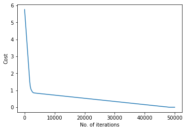

# TASK 1 - CRITERIONS
***

This repo contains my submission to the Task 1 of Secretary Recruitment tasks.

## Problem Statement

There exists a Mean Squared Error Loss function |x -  x̂|². We want you to experiment with different types of loss functions. Consider the following loss functions:
- |x -  x̂|³
- |x -  x̂|
- |x -  x̂|⁴
- |x -  x̂|⁷

Train a Linear Regression model using (a.) and (b.) as criterion and a polynomial regression (2nd degree polynomial) model using (c.) and (d.) as criterion.You are allowed to use only numpy, pandas (won’t be needed) and matplotlib to plot your results.
***
For the Linear Regression model , I have used ```y = 2x+11 ``` as linear polynomial , whereas , for polynomial regression , the curve x<sup>2</sup> + 4x+4 is used .
Gradient Descent optimisation algorithm is used in all the four models .
I trained all the models for 50000 iterations with suitable learning rate and obtained the predicted values by our model. 
The code implemented in training the models are in the notebooks . 

## Plots

#### (a.) Linear Regression with |x -  x̂|³ 


#### (b.) Linear Regression with |x -  x̂|


#### (c.) Polynomial Regression with |x -  x̂|⁴


#### (d.) Polynomial Regression with |x -  x̂|⁷


***

### Loss Plots

Note : All the models are trained for 50000 epochs . The plot in the left side depicts plot for 50000 epochs , whereas , on the right side , the plot shows the cost for last 40000 epochs.

#### (a.) Linear Regression with |x -  x̂|³ 
 

#### (b.) Linear Regression with |x -  x̂|
 

#### (c.) Polynomial Regression with |x -  x̂|⁴
 

#### (d.) Polynomial Regression with |x -  x̂|⁷
 

***
